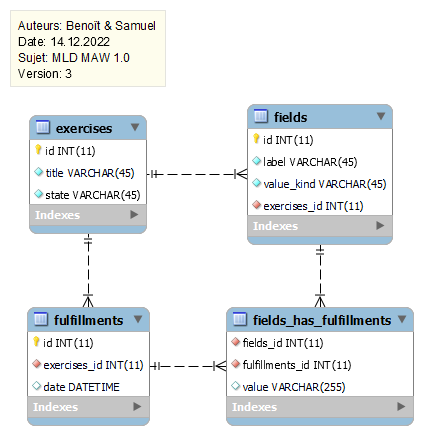

# 
Documentation

## Introduction

Dans ce projet, nous devons copier d'un site web en l'améliorant.
Nous avons déjà travaillé sur ce projet durant le premier trimestre.

## MCD

## MLD

## Réalisation

Pour réaliser ce projet, nous avons commencé par faire les exercices. Ils sont la base du site et utilisés partout et par toutes les parties du site.
Nous avons créé des tests qui permettent de tester si nous n'ajoutons pas de bug avec nos fonctionnalités.

Le projet contient les classes suivantes :

- Exercise
- Field
- Fulfillment
- DBconnection
- Query

## Technologies

Nous avons utilisé :

- Languages
    - Php / 8.1
    - Markdown
- Software
    - PhpStorm / 2022.2
    - IceScrum
    - Github
    - Chromium
- Server
    - Apache
- Database
    - MySQL 15.1
    - MariaDB 10.9
    - HeidiSQL
    - MCD : Draw.io
    - MLD : MySQL Workbench 8.0 CE

## Contraintes

- HTML CSS PHP
- Pas de JS

L'utilisation de framework n'est pas autorisée.
Par contre l'utilisation de librairies fournissant un service de bas niveau est autorisé.  
Exemples : moteur de templating, router simple.  
Contre-exemples: ORM, composants de framework comme Symfony.