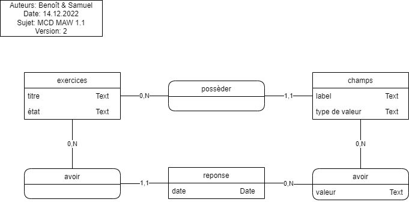

# <center>Documentation</center>

## Introduction

Dans ce projet, nous devons copier d'un site web en l'améliorant. Le concept du site est de pouvoir avoir un ouitl web qui permet de créer un exercise et d'y répondre sans gestion des utilisateur du site. Il n'y a pas besoin de se connecter au site pour l'utiliser. Ce n'est d'ailleur pas possible de se connecter sur le site. Le projet est construit en MVC (Modèle Vue Controller). Il utilise une base de donneés MySQL.
La documentation contien un model conceptuel de donnée, pour visualiser la base de donnée d'un point de vue métier et un model logique de données.


## Installation
### Prérequis
Veuillez vous référez à la section téchnologie pour obtenir les versions des composants utilisés.

### Procédure

1. Récuperer le repository depuis Github (clone, fork ou téléchargement .zip) (https://github.com/CPNV-ES/MAW1-BPT-SMD)
1. Faire un `composer install` à la racine du projet
1. Ouvrir le fichier `const.php.exemple` et remplir les champs en majuscule [HOSTNAME,DBNAME,DB_USER,SB_PASSWORD] avec vos informations.
  1. Renommer le fichier en `const.php`
1. Lancer le serveur PHP via la commande `php -S 127.0.0.1:8888 -t public`


## Fonctionnement du projet

### Structure MVC

Le site utilise une structure MVC (Model Vue Controller) elle permet de séprarer les parties UI (User Interface) et BL (Business Logic).

## MCD



## MLD


## Technologies

Nous avons utilisé :

- Languages
    - Php / 8.1
    - Markdown
- Software
    - PhpStorm / 2022.2
    - IceScrum
    - Github
    - Chromium
- Server
    - Apache
- Database
    - MySQL 15.1
    - MariaDB 10.9
    - HeidiSQL
    - MCD : Draw.io
    - MLD : MySQL Workbench 8.0 CE

## Contraintes

- HTML CSS PHP
- Pas de JS

L'utilisation de framework n'est pas autorisée.
Par contre l'utilisation de librairies fournissant un service de bas niveau est autorisé.  
Exemples : moteur de templating, router simple.  
Contre-exemples: ORM, composants de framework comme Symfony.

## Réalisation

Pour réaliser ce projet, nous avons commencé par faire les exercices. Ils sont la base du site et utilisés partout et par toutes les parties du site.
Nous avons créé des tests qui permettent de tester si nous n'ajoutons pas de bug avec nos fonctionnalités.


### Classes  

- Exercise
- Field
- Fulfillment
- DBconnection
- Query

### Models
Nos models sont globalement assez similiaire les uns au autres. Cependant ils ont tout de même des méthodes qui différent légèrement. Voici les méthodes notables du model Exercice : 
- Une fonction qui permet de récupérer les champs d'un exercice. Si un ID de champ est spécifié, elle renvoie un objet Field correspondant à ce champ, sinon elle renvoie un tableau contenant tous les objets Field associés à l'exercice.

  
  ```php 
    public function getFields(int $fieldId = null): array|Field
    {
        if (is_null($fieldId)) {
            return $this->query->select('fields', Field::class, 'exercises_id = :id', [':id' => $this->id]);
        } else {
            return $this->query->select('fields', Field::class, 'id  = :field_id AND exercises_id = :exercises_id', ['field_id' => $fieldId, 'exercises_id' => $this->id], true);
        }
    }
  ```
- Une fonction qui permet de créer un exercice, à partir des valeur `label, value_kind, exercise_id`. En cas d'échec, une erreur est retournée:
```php
- public function createField(Field $field): int
  {
      try {
          return $this->query->insert('fields', Field::class, [
              'label'        => $field->getLabel(),
              'value_kind'   => $field->getValueKind(),
              'exercises_id' => $this->id,
          ]);
      } catch (PDOException $e) {
          error_log($e);
          return false;
      }
  } 
```
- Une fonction qui permet de récupérer les fulfillments en retournant tout les fulfillment pour un exercice si aucune id n'est donnée, et un fulfillment précis, si sont id est donnée:
```php 
  public function getFulfillments(int $fulfillment = null): array|Fulfillment
  {
      if (is_null($fulfillment)) {
          return $this->query->select('fulfillments', Fulfillment::class, 'exercises_id = :id', [':id' => $this->id]);
      } else {
          return $this->query->select('fulfillments', Fulfillment::class, 'id = :field_id AND exercises_id = :exercises_id', ['field_id' => $fulfillment, 'exercises_id' => $this->id], true);
      }
  }
```

Le projet contient les models suivants:

**Exercise**  
**ExerciseHelper**  
**Field**  


### Controllers
Nos controllers se basent sur un fichier qui contient une classe abstraite appelée Controller qui est utilisée pour généraliser le comportement des contrôleurs de l'application. 
La classe Controller définit deux propriétés: un objet DBConnection et un objet Router. La méthode view()` est utilisée pour afficher une vue et prend en paramètre le chemin de la vue et un tableau d'options facultatif pour remplir les variables de la vue.

Voici un exemple de la classe générique Controller:
- Cette fonction permet d'afficher une vue. On lui donne le chemin d'accès de la vue et il se charche de prendre la bonne vue pour l'afficher.
```php 
  protected function view(string $path, array $params = null): void
  {
      ob_start();
      require TEMPLATES_DIR . $path . '.php';
      $content = ob_get_clean();
      require TEMPLATES_DIR . 'layout.php';
  }
```

Voici des exemples du controller ExerciseController:
- Cette fonction permet d'afficher la vue pour répondre à un exercice, en lui donnant les variables nécessaires.
```php 
    public function answering(): void
      {
          $this->view('exercises/answering', [
              'exercises' => $this->exerciseHelper->get(),
              'router'    => $this->router,
          ]);
      }
```

- Cette fonction permet de supprimer un exercice à partir de sont id. Puis de rediriger vers la liste des exercices.
```php 
  public function delete(int $exerciseId): void
  {
      $this->exerciseHelper->delete($exerciseId);
      $this->router->redirect('exercises_index');
  } 
```
